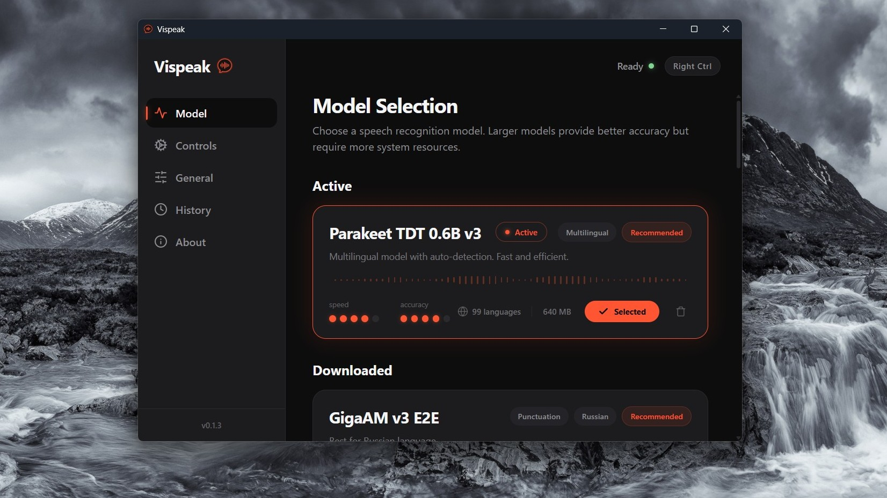

# Vispeak

Vispeak is a desktop application for local offline voice-to-text dictation triggered by a global hotkey.

Read this in: English | [Русский](README.ru.md)

## Features
- 🎙️ **Completely Offline**: Audio is never sent to any servers. Everything is processed locally using Whisper models.
- ⚡ **Global Hotkey**: Press `Ctrl+Space` (default) in any app, speak your text, release the keys — and the text is pasted.
- 🎨 **Modern UI**: Dark interface built with Tauri 2 and React.
- 📦 **Choose your Model**: Use lightweight models for speed or larger ones for accuracy. Models are downloaded on-demand and are not bundled with the app.

## Screenshots

<details>
<summary>Main Window — Model Selection</summary>



</details>

<details>
<summary>Overlay Widget — Recording</summary>


</details>

## 🤖 Speech Recognition (Models)
The application supports various models for transcription. **These are not bundled with the app and are downloaded automatically from Hugging Face only upon your explicit request in the settings.**

| Model Family | License | Source (Hugging Face) | Description |
|--------------|---------|-----------------------|-------------|
| **Whisper** | MIT | `ggerganov/whisper.cpp` | Base models from OpenAI |
| **Parakeet TDT / Canary v2** | CC-BY-4.0 | `istupakov/...` | High-accuracy models from NVIDIA |
| **GigaAM v3** | MIT | `istupakov/gigaam-v3-onnx` | Best for Russian language (SberDevices) |
| **Nemotron / Qwen** | Various | `handy-computer/...` | Models in GGUF format |

For detailed information about licenses and model sources, see [THIRD_PARTY_LICENSES.md](./THIRD_PARTY_LICENSES.md).

## 🔒 Privacy
- **Local Processing**: All speech recognition is performed entirely locally on your device. Audio and transcribed text are never sent to any external servers.
- **Local History**: Dictation history is stored locally in `%LOCALAPPDATA%/app.vispeak` and is fully managed by the user (you can set storage limits or clear it completely).
- **Network Requests**: The app makes only two types of network requests: checking for and downloading updates (GitHub Releases), and downloading models from Hugging Face (only upon explicit user action). There is absolutely no telemetry or analytics.

## 💖 Support the Project
If you like Vispeak and want to support its development, you can do so here:
- [Boosty](https://boosty.to/v2p/donate)
- [DaLink](https://dalink.to/v2p)

Crypto wallets:
- **BTC**:
  ```text
  12tSjndfTjfttXsckBqQwbrZZADWbEeiLi
  ```
- **USDT (ERC20)**:
  ```text
  0xeff9305f8f48261c3f4b3990306bece26788a04c
  ```
- **USDT (TRC20)**:
  ```text
  TCVzqHNmYq9KZRbH3GcZgWNnQeet1hFckp
  ```

## Requirements (Windows)
- Windows 10/11 (64-bit)
- To build from source, you need Rust, Node.js, LLVM, and MSVC Build Tools installed.

## Usage
1. Launch the app. It will appear in the system tray.
2. In the settings window, go to the **Model** tab and download your preferred model.
3. Click **Select** to make it the active model.
4. Open any text editor or input field (Notepad, browser, messenger).
5. Press and hold `Ctrl+Space` (or your chosen hotkey) to start dictating. A small floating widget will appear.
6. Release the keys. The transcribed text will be automatically pasted into the active window.
7. You can cancel dictation by pressing `Esc` while recording.

## Build from Source

```bash
# Clone the repository
git clone https://github.com/ViPunch/Vispeak.git
cd Vispeak

# Install dependencies
npm install

# Run in dev mode
npm run tauri dev

# Build the release binary
npm run tauri build
```

## License
Vispeak is licensed under the MIT License. See [LICENSE](./LICENSE) for details.
Information about third-party libraries and models is available in [THIRD_PARTY_LICENSES.md](./THIRD_PARTY_LICENSES.md).
