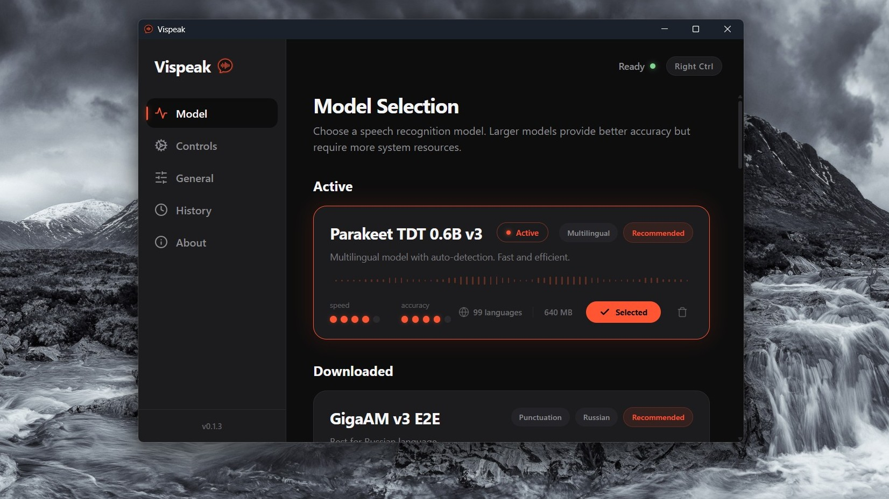

# Vispeak

Vispeak — desktop-приложение для локальной офлайн-транскрибации голоса по глобальной горячей клавише.

Читать на: [English](README.md) | Русский

## Особенности
- 🎙️ **Полностью офлайн**: Аудио не отправляется на сторонние серверы, всё обрабатывается локально на вашем компьютере с помощью моделей Whisper.
- ⚡ **Глобальный хоткей**: Нажмите `Ctrl+Space` (по умолчанию) в любом приложении, произнесите текст, отпустите клавишу — и текст будет вставлен.
- 🎨 **Современный UI**: Темный интерфейс на базе Tauri 2 и React.
- 📦 **Модели на выбор**: Используйте легкие модели для скорости или более крупные для точности распознавания. Все модели загружаются отдельно от приложения по запросу пользователя.

## Скриншоты

<details>
<summary>Главное окно — Выбор модели</summary>



</details>

<details>
<summary>Виджет оверлея — Запись</summary>


</details>

## 🤖 Распознавание речи (Модели)
Приложение поддерживает различные модели для транскрибации. **Они не входят в состав приложения и скачиваются автоматически с Hugging Face только по вашему явному запросу в настройках.**

| Семейство моделей | Лицензия | Источник (Hugging Face) | Описание |
|-------------------|----------|-------------------------|----------|
| **Whisper** | MIT | `ggerganov/whisper.cpp` | Базовые модели от OpenAI (через whisper.cpp) |
| **Parakeet TDT / Canary v2** | CC-BY-4.0 | `istupakov/...` | Модели от NVIDIA с высокой точностью |
| **GigaAM v3** | MIT | `istupakov/gigaam-v3-onnx` | Лучший выбор для русского языка (SberDevices) |
| **Nemotron / Qwen** | Разные | `handy-computer/...` | Модели в формате GGUF |

Подробную информацию о лицензиях и источниках моделей см. в [THIRD_PARTY_LICENSES.md](./THIRD_PARTY_LICENSES.md).

## 🔒 Конфиденциальность (Privacy)
- **Локальная обработка**: Всё распознавание речи выполняется исключительно локально на вашем устройстве. Аудио и распознанный текст никогда не отправляются ни на какие серверы.
- **Локальная история**: История диктовок хранится локально в `%LOCALAPPDATA%/app.vispeak` и полностью управляется пользователем (можно настроить лимит хранения или полностью очистить).
- **Сетевые обращения**: Приложение выполняет только два вида сетевых запросов: проверка и скачивание обновлений (GitHub Releases) и скачивание моделей с Hugging Face (только по явному действию пользователя). Телеметрия и аналитика полностью отсутствуют.

## 💖 Поддержать проект
Если вам нравится Vispeak и вы хотите поддержать разработку, вы можете сделать это по ссылкам ниже:
- [Boosty](https://boosty.to/v2p/donate)
- [DaLink](https://dalink.to/v2p)

## Требования (Windows)
- Windows 10/11 (64-bit)
- Если вы собираете из исходников, потребуется установленный Rust, Node.js, LLVM и MSVC Build Tools.

## Установка и использование
1. Запустите приложение. Оно появится в системном трее.
2. В окне настроек перейдите на вкладку **Модель** и скачайте нужную модель.
3. Нажмите кнопку **Выбрать**, чтобы сделать модель активной.
4. Откройте любой текстовый редактор или поле ввода (Блокнот, браузер, мессенджер).
5. Нажмите и удерживайте `Ctrl+Space` (или выбранную вами горячую клавишу) для начала диктовки. Появится небольшой плавающий виджет.
6. Отпустите клавиши. Распознанный текст будет автоматически вставлен в активное окно.
7. Вы можете отменить диктовку, нажав `Esc` во время записи.

## Linux (x86_64)

Добавлен код интеграции X11 и Wayland, конфигурации `.deb` для Ubuntu/Debian, `.rpm` для Fedora и рецепт сборки для Arch. Статус проверок, зависимости и ограничения рабочих окружений — в [руководстве Linux](docs/LINUX.md). Начиная с v1.3.0, assets релиза включают `.deb` для Ubuntu/Debian, `.rpm` для Fedora и архив исполняемого файла для Arch с рецептом сборки из исходников. Пользовательское тестирование ограничено Fedora 44 KDE Plasma 6.7.5 / KWin 6.7.5, Wayland.

## Сборка из исходников

```bash
# Клонируйте репозиторий
git clone https://github.com/V2P-Dev/Vispeak.git
cd Vispeak

# Установите зависимости
npm install

# Запустите в режиме разработчика
npm run tauri dev

# Соберите релизный бинарник
npm run tauri build
```

## Лицензия
Vispeak распространяется под лицензией MIT. Подробности в файле [LICENSE](./LICENSE).
Информация о сторонних библиотеках и моделях доступна в [THIRD_PARTY_LICENSES.md](./THIRD_PARTY_LICENSES.md).
